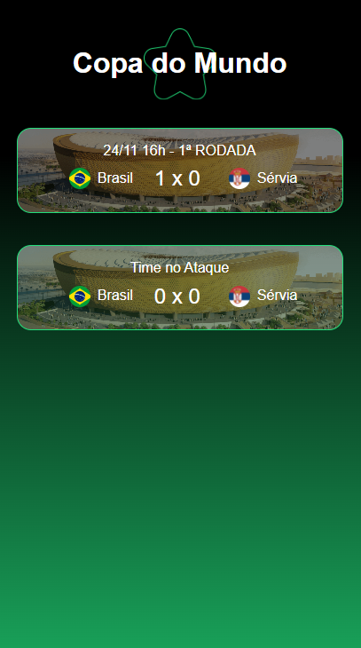

# ⚽️Copa do Mundo em Tempo Real

 
 <h2>💻Tecnologias utilizadas: </h2> 

 - 
 - 
 - 
 - 
 
 
 <h2> 👨‍💻 Nesse projeto aprendi a atualizar dados de um site em tempo real com HTML, CSS, JavaScript e Firebase na live da DIO </h2>
 
 App final:
 
 

    

 
